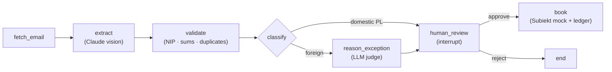

# Invoicer

> Agentic AI assistant that pulls invoices from a client's mailbox, extracts and validates them under **Polish tax law**, reasons about edge cases (e.g. a UK invoice with no VAT), and books them to accounting software — **only after a human approves**.

Built with **LangGraph** + **Claude** (vision + structured output), in a clean ports-and-adapters architecture, test-driven throughout.

> **Status:** working end-to-end pipeline on fixtures/CLI. Portfolio project — the accounting sink (Subiekt) is mocked behind an adapter (the real Subiekt GT API needs Windows + COM); the design leaves a clean seam for the real integration.

---

## What it does



1. **Fetch** — pull a PDF invoice attachment from a specific sender.
2. **Extract** — Claude vision reads the PDF/scan into a structured `Invoice` (amounts as `Decimal`, dates parsed).
3. **Validate** — deterministic checks: Polish NIP checksum, `net + VAT = gross` (per line and globally), duplicate detection against an append-only ledger.
4. **Classify** — domestic PL vs foreign (EU / non-EU) tax treatment.
5. **Reason (exceptions)** — for foreign invoices, an LLM judge proposes the correct treatment (e.g. UK SaaS → *import of services / reverse charge*), with a rationale and a list of things the human must confirm.
6. **Human review** — the graph **pauses** (`interrupt`) and waits for a human to approve, reject, or edit. No booking happens without approval.
7. **Book** — on approval, map to a booking payload, post via the accounting adapter, and append to the ledger (audit + idempotency).

## Why it's interesting

- **Knows when *not* to be autonomous.** A mostly-deterministic workflow with LLM "islands" (extraction, exception reasoning) and a hard human gate before any booking — a deliberate, mature agent design rather than an unbounded autonomous loop.
- **Real Polish-tax substance.** NIP checksum, `net+VAT=gross` reconciliation (per-line, so cancelling errors can't hide), reverse-charge / import-of-services reasoning for non-EU invoices.
- **Security-first.** Prompt-injection defense (the document rides as a separate *data* block, never as instructions; structured output; the human gate authorizes the only side effect). The exception-reasoning step receives **only an allow-listed summary** — no buyer PII or addresses leave the process.
- **CI-testable LLM integration.** The LLM is injected behind a port, so the whole pipeline runs deterministically against a fake in CI; the real Anthropic API is exercised by a single **live-gated** smoke test that skips without a key.

## Architecture

Ports-and-adapters around a LangGraph state machine — the core depends only on protocols, so I/O is swappable:

| Port | Mock / offline adapter | Real adapter |
|------|------------------------|--------------|
| `EmailSource` | `FixtureSource` (local PDFs) | `GmailAdapter` *(planned)* |
| `InvoiceExtractor` | `StubExtractor` | **`ClaudeVisionExtractor`** ✅ |
| `ExceptionReasoner` | `IdentityReasoner` / `StubExceptionReasoner` | **`ClaudeExceptionReasoner`** ✅ |
| `AccountingSink` | `MockSubiektSink` | `SubiektSferaSink` *(Windows/COM, planned)* |
| `HumanReview` | CLI (`process_document`) | Streamlit *(planned)* |

Swapping the stub extractor for real Claude vision is a one-line change — the graph, state, and nodes are untouched:

```python
build_invoice_graph(extractor=ClaudeVisionExtractor(), reasoner=ClaudeExceptionReasoner(), ...)
```

## Tech stack

Python 3.12 · [uv](https://github.com/astral-sh/uv) · **LangGraph** (state graph, `interrupt`, checkpointer) · **langchain-anthropic** (`ChatAnthropic`, `with_structured_output`, multimodal) · Pydantic v2 · pytest · ruff.

## Testing

- **103 unit/integration tests + 2 live-gated** — TDD throughout (failing test → minimal implementation → commit).
- The full pipeline (including the real LangGraph `interrupt`/resume HITL flow) runs deterministically in CI via injected fakes.
- Live tests hitting the real Anthropic API are gated behind `ANTHROPIC_API_KEY` (+ a fixture) and skip otherwise.

```bash
uv sync
uv run pytest -q          # 103 passed, 2 skipped (live)
uv run ruff check .
```

To run the live tests, set `ANTHROPIC_API_KEY` and drop a real invoice PDF at `tests/live/fixtures/sample_invoice.pdf`.

## Roadmap

- [x] Foundations — domain models + Polish-tax validation
- [x] Ports & ledger — adapters + append-only ledger with duplicate detection
- [x] LangGraph graph + CLI human-in-the-loop
- [x] Real Claude vision extraction
- [x] LLM exception reasoning (foreign-invoice tax treatment)
- [ ] Real Gmail connector (OAuth read-only)
- [ ] Streamlit demo UI
- [ ] Hardening — prompt-injection eval fixtures, tamper-evident audit log, observability, type checking

---

*This is a portfolio project. It demonstrates agent design, Polish-tax domain modeling, and security-conscious LLM integration; it is not a certified tax tool — every booking is gated by a human.*
