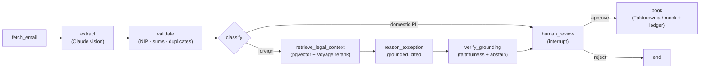

# Invoicer

[](https://gitlab.com/m.studniarski/invoicer/-/commits/main)

> Agentic AI assistant that pulls invoices from a client's mailbox, extracts and validates them under **Polish tax law**, reasons about edge cases (e.g. a UK invoice with no VAT), and books them to accounting software — **only after a human approves**.

Built with **LangGraph** + **Claude** (vision + structured output), in a clean ports-and-adapters architecture, test-driven throughout.

> **Status:** working end-to-end pipeline on fixtures/CLI. Portfolio project — the accounting sink (Subiekt) is mocked behind an adapter (the real Subiekt GT API needs Windows + COM); the design leaves a clean seam for the real integration.

---

## What it does



1. **Fetch** — pull a PDF invoice attachment from a specific sender.
2. **Extract** — Claude vision reads the PDF/scan into a structured `Invoice` (amounts as `Decimal`, dates parsed).
3. **Validate** — deterministic checks: Polish NIP checksum, `net + VAT = gross` (per line and globally), duplicate detection against an append-only ledger.
4. **Classify** — domestic PL vs foreign (EU / non-EU) tax treatment.
5. **Reason (exceptions)** — for foreign invoices, an LLM judge proposes the correct treatment (e.g. UK SaaS → *import of services / reverse charge*), with a rationale and a list of things the human must confirm.
6. **Human review** — the graph **pauses** (`interrupt`) and waits for a human to approve, reject, or edit. No booking happens without approval.
7. **Book** — on approval, map to a booking payload, post via the accounting adapter, and append to the ledger (audit + idempotency).

## Why it's interesting

- **Knows when *not* to be autonomous.** A mostly-deterministic workflow with LLM "islands" (extraction, exception reasoning) and a hard human gate before any booking — a deliberate, mature agent design rather than an unbounded autonomous loop.
- **Real Polish-tax substance.** NIP checksum, `net+VAT=gross` reconciliation (per-line, so cancelling errors can't hide), reverse-charge / import-of-services reasoning for non-EU invoices.
- **Security-first.** Prompt-injection defense (the document rides as a separate *data* block, never as instructions; structured output; the human gate authorizes the only side effect). The exception-reasoning step receives **only an allow-listed summary** — no buyer PII or addresses leave the process.
- **CI-testable LLM integration.** The LLM is injected behind a port, so the whole pipeline runs deterministically against a fake in CI; the real Anthropic API is exercised by a single **live-gated** smoke test that skips without a key.

### Legal-grounded corrective RAG

Foreign-invoice tax reasoning is **grounded in real Polish VAT law**, not the model's memory: the
agent retrieves the relevant provisions (`art. 28b`, `art. 17` reverse charge, WNT, import) from a
**pgvector** store (embeddings + reranking via **Voyage AI**), generates a classification that
**cites its legal basis**, then a **faithfulness check** verifies each citation is actually supported
by the source. When grounding is weak or unsupported, the agent **abstains** — it caps its confidence
and flags the human, never auto-booking. Retrieval quality, faithfulness, and with/without-RAG
treatment accuracy are measured in [`docs/evals/legal-rag-report.md`](docs/evals/legal-rag-report.md).

## Architecture

Ports-and-adapters around a LangGraph state machine — the core depends only on protocols, so I/O is swappable:

| Port | Mock / offline adapter | Real adapter |
|------|------------------------|--------------|
| `EmailSource` | `FixtureSource` (local PDFs) | `GmailAdapter` *(planned)* |
| `InvoiceExtractor` | `StubExtractor` | **`ClaudeVisionExtractor`** ✅ |
| `ExceptionReasoner` | `IdentityReasoner` / `StubExceptionReasoner` | **`ClaudeExceptionReasoner`** ✅ |
| `AccountingSink` | `MockSubiektSink` (offline/demo) | **`FakturowniaSink`** ✅ (REST, cost invoice) |
| `HumanReview` | CLI (`process_document`) | Streamlit *(planned)* |
| `Embedder` | `DeterministicEmbedder` (CI) | **`VoyageEmbedder`** ✅ (`voyage-3-large`) |
| `LegalKnowledgeStore` | `InMemoryLegalStore` (CI) | **`PgVectorLegalStore`** ✅ (pgvector + Voyage rerank) |

Swapping the stub extractor for real Claude vision is a one-line change — the graph, state, and nodes are untouched:

```python
build_invoice_graph(extractor=ClaudeVisionExtractor(), reasoner=ClaudeExceptionReasoner(), ...)
```

## Tech stack

Python 3.12 · [uv](https://github.com/astral-sh/uv) · **LangGraph** (state graph, `interrupt`, checkpointer) · **langchain-anthropic** (`ChatAnthropic`, `with_structured_output`, multimodal) · Pydantic v2 · pytest · ruff.

## Testing

- **103 unit/integration tests + 2 live-gated** — TDD throughout (failing test → minimal implementation → commit).
- The full pipeline (including the real LangGraph `interrupt`/resume HITL flow) runs deterministically in CI via injected fakes.
- Live tests hitting the real Anthropic API are gated behind `ANTHROPIC_API_KEY` (+ a fixture) and skip otherwise.

```bash
uv sync
uv run pytest -q          # 103 passed, 2 skipped (live)
uv run ruff check .
```

To run the live tests, set `ANTHROPIC_API_KEY` and drop a real invoice PDF at `tests/live/fixtures/sample_invoice.pdf`.

## Roadmap

- [x] Foundations — domain models + Polish-tax validation
- [x] Ports & ledger — adapters + append-only ledger with duplicate detection
- [x] LangGraph graph + CLI human-in-the-loop
- [x] Real Claude vision extraction
- [x] LLM exception reasoning (foreign-invoice tax treatment)
- [ ] Real Gmail connector (OAuth read-only)
- [ ] Streamlit demo UI
- [ ] Hardening — prompt-injection eval fixtures, tamper-evident audit log, observability, type checking

---

## Deploy (Fly.io)

The agent runs 24/7 as a single always-on service: a real `POST /whatsapp/inbound` webhook
+ an in-process scheduler for the daily intake (08:00 Europe/Warsaw) + durable SQLite on a volume.

### 1. One-time setup

```bash
# 1) Fly account + CLI
brew install flyctl
fly auth login

# 2) Create the app from the existing fly.toml (DO NOT regenerate it)
fly launch --copy-config --no-deploy

# 3) Volume for /data (region matching fly.toml, e.g. waw)
fly volumes create invoicer_data --region waw --size 1

# Postgres + pgvector dla legal-grounding RAG
fly postgres create --name invoicer-db --region ams
fly postgres attach invoicer-db   # ustawia sekret DATABASE_URL

# 4) Secrets (all in one shot)
fly secrets set \
  ANTHROPIC_API_KEY="..." \
  TWILIO_ACCOUNT_SID="AC..." \
  TWILIO_AUTH_TOKEN="..." \
  TWILIO_WHATSAPP_FROM="whatsapp:+14155238886" \
  APPROVER_WHATSAPP_TO="whatsapp:+48..." \
  FAKTUROWNIA_API_TOKEN="..." \
  FAKTUROWNIA_DOMAIN="mstudniarski" \
  GMAIL_SENDER_FILTER="m.studniarski@gmail.com" \
  INVOICER_SINK="fakturownia" \
  VOYAGE_API_KEY="..." \
  DATABASE_URL="postgres://..."

# 5) Gmail token (headless): encode the local token.json into a secret
fly secrets set GMAIL_TOKEN_B64="$(base64 -i token.json)"
```

### 2. Deploy

```bash
fly deploy
fly logs       # live logs
curl -s https://<your-app>.fly.dev/health
curl -s https://<your-app>.fly.dev/status | jq
```

### 3. WhatsApp webhook in Twilio

Twilio Console → Messaging → Sandbox → "When a message comes in":

```
https://<your-app>.fly.dev/whatsapp/inbound   (POST)
```

### 4. Updates (CI/CD)

Auto-deploy: after a green CI run on `main`, the `deploy.yml` workflow runs `flyctl deploy`
(rolling restart; state on `/data` survives). One-time: add the Fly token to GitHub secrets:

```bash
fly tokens create deploy -x 999999h   # deploy token
# GitHub repo → Settings → Secrets and variables → Actions → New repository secret:
#   name: FLY_API_TOKEN   value: <the token above>
```

Manual deploy (when needed): `fly deploy`.

### Gmail token rotation

The refresh token is long-lived. If it expires:
1. Run `authorize_gmail(...)` locally → new `token.json`.
2. `fly secrets set GMAIL_TOKEN_B64="$(base64 -i token.json)"`.
3. `fly deploy` (machine restart loads the new token).

---

*This is a portfolio project. It demonstrates agent design, Polish-tax domain modeling, and security-conscious LLM integration; it is not a certified tax tool — every booking is gated by a human.*

## Run locally

```bash
set -a; source .env; set +a
PYTHONPATH=src uv run python scripts/run_flow_now.py
```

## Reset local state

```bash
# 1. Backup ledger (hash-chained audit log)
mv ledger.jsonl ledger.jsonl.bak-$(date +%Y%m%d-%H%M%S)

# 2. Wipe SQLite database (the processed_documents table lives here)
mv invoicer_state.sqlite invoicer_state.sqlite.bak-$(date +%Y%m%d-%H%M%S) 2>/dev/null
```
