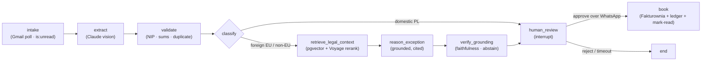

# Invoicer

[](https://github.com/mstudniarski-arch/invoicer/actions/workflows/ci.yml)

> Agentic AI assistant that pulls invoices from a mailbox, extracts and validates them under **Polish tax law**, reasons about edge cases (e.g. a UK invoice with no VAT) grounded in the actual statute, and books them to accounting software — **only after a human approves over WhatsApp**.

Built with **LangGraph** + **Claude** (vision + structured output) in a clean ports-and-adapters architecture, test-driven throughout, and running 24/7 on Fly.io.

> **Status:** live end-to-end. Real **Gmail** intake → **Claude** extraction → legal-grounded **corrective RAG** (pgvector + Voyage) → **human approval over WhatsApp** → booking to **Fakturownia** (real REST) + a hash-chained audit ledger. `MockSubiektSink` remains behind the same port for offline/demo (the real Subiekt GT API needs Windows + COM). Portfolio project — not a certified tax tool; every booking is human-gated.

---

## What it does



1. **Intake** — an interval scheduler polls Gmail for **unread** PDF invoices from a configured sender (`is:unread` + a lookback window + document-level dedup).
2. **Extract** — Claude vision reads the PDF/scan into a structured `Invoice` (amounts as `Decimal`, dates parsed) via `with_structured_output`.
3. **Validate** — deterministic checks: Polish NIP checksum, `net + VAT = gross` (per line **and** globally, so cancelling errors can't hide), duplicate detection against the append-only ledger.
4. **Classify** — domestic PL vs foreign (EU / non-EU) tax bucket, from the seller's country.
5. **Reason (foreign only)** — legal-grounded corrective RAG proposes the correct treatment (e.g. UK SaaS → *import of services / reverse charge*) **with a cited legal basis**, then a faithfulness check verifies each citation and **abstains** when grounding is weak.
6. **Human review** — the graph **pauses** (`interrupt`) and sends a WhatsApp approval request with signed tap-to-approve links. Nothing books without an explicit approve.
7. **Book** — on approval, map to a booking payload, POST to the accounting adapter, append to the hash-chained ledger (audit + idempotency), and **mark the source email read** (best-effort).

## Why it's interesting

- **Knows when *not* to be autonomous.** A mostly-deterministic LangGraph workflow with LLM "islands" (extraction, exception reasoning) and a hard human gate before any booking — a deliberate, mature agent design rather than an unbounded autonomous loop. (It is a hand-authored DAG with routing, not a ReAct tool-calling agent — by design.)
- **Real Polish-tax substance.** NIP checksum, `net+VAT=gross` reconciliation, reverse-charge / import-of-services / WNT reasoning for foreign invoices, and cost-invoice specifics that match how Fakturownia actually renders documents.
- **Security-first.** Prompt-injection defense (the document rides as a separate *data* block, never as instructions; structured output; the human gate authorizes the only side effect). The exception-reasoning step receives **only an allow-listed summary** — no buyer PII or addresses leave the process. PII is redacted from logs.
- **CI-testable LLM integration.** Every external dependency is injected behind a port, so the whole pipeline (including the `interrupt`/resume HITL flow and the RAG sub-flow) runs deterministically against fakes in CI; the real Anthropic / Voyage / pgvector / Gmail / Fakturownia paths are exercised by **live-gated** tests that skip without credentials.

### Legal-grounded corrective RAG

Foreign-invoice tax reasoning is **grounded in real Polish VAT law**, not the model's memory: the agent retrieves the relevant provisions (`art. 28b`, `art. 17` reverse charge, WNT, import) from a **pgvector** store (embeddings + reranking via **Voyage AI**), generates a classification that **cites its legal basis**, then a **faithfulness check** verifies each citation is actually supported by the source. When grounding is weak or unsupported, the agent **abstains** — it caps its confidence and flags the human, never auto-booking. Retrieval quality, faithfulness, and with/without-RAG treatment accuracy are measured in [`docs/evals/legal-rag-report.md`](docs/evals/legal-rag-report.md).

See all three grounding states (abstention / grounded / unsupported) in one command:
`PYTHONPATH=src uv run python scripts/rag_demo.py`.

## Architecture

Ports-and-adapters around a LangGraph state machine — the core depends only on protocols (`src/invoicer/ports.py`), so I/O is swappable and testable:

| Port | Mock / offline adapter | Real adapter |
|------|------------------------|--------------|
| `EmailSource` | `FixtureSource` / upload | **`GmailAdapter`** ✅ (Gmail API, `gmail.modify`) |
| `InvoiceDetector` | `StubInvoiceDetector` | **`ClaudeInvoiceDetector`** ✅ |
| `InvoiceExtractor` | `StubExtractor` | **`ClaudeVisionExtractor`** ✅ (`claude-sonnet-4-6`) |
| `ExceptionReasoner` | `IdentityReasoner` / `StubExceptionReasoner` | **`ClaudeExceptionReasoner`** ✅ |
| `AccountingSink` | `MockSubiektSink` (offline/demo) | **`FakturowniaSink`** ✅ (REST, cost invoice) |
| `ApprovalChannel` | `StubApprovalChannel` / CLI | **`TwilioWhatsAppChannel`** ✅ (+ signed tap-to-approve links) |
| `Embedder` | `DeterministicEmbedder` (CI) | **`VoyageEmbedder`** ✅ (`voyage-3-large`) |
| `Reranker` | — | **`VoyageReranker`** ✅ |
| `LegalKnowledgeStore` | `InMemoryLegalStore` (CI) | **`PgVectorLegalStore`** ✅ (pgvector + Voyage rerank) |

The graph is assembled in `src/invoicer/graph/build.py` from eight nodes — `extract → validate → classify → (retrieve_legal_context → reason_exception → verify_grounding) → human_review → book` — with three routers (`route_after_validate`, `route_after_classify`, `route_after_review`). Swapping any adapter is a constructor argument; the graph, state, and nodes are untouched:

```python
build_invoice_graph(extractor=ClaudeVisionExtractor(), reasoner=ClaudeExceptionReasoner(), sink=build_sink(), ...)
```

### Two-phase human-in-the-loop

One logical run spans **two `graph.invoke` calls**, joined only by a `thread_id` + a durable checkpointer:

- **Phase 1** (`start_document`) runs `extract → … → human_review`, where `interrupt(payload)` **suspends** the run and returns the approval payload.
- **Phase 2** (`resume_document`, `graph.invoke(Command(resume=decision))`) reloads the checkpoint and continues `book → END`. Because the checkpointer is SQLite on a volume (`check_same_thread=False`), a **different process** — the WhatsApp webhook or a tap-to-approve link — can resume the same run hours later.

A full line-by-line walkthrough lives in [`docs/flow-walkthrough.md`](docs/flow-walkthrough.md); `scripts/debug_flow.py` narrates one run node-by-node offline.

## How an invoice flows — EU vs non-EU

EU and non-EU invoices take the **same graph path** — they differ only in *values*: the `country_bucket`, the law retrieved, and the proposed tax treatment.

```text
intake → extract → validate → classify?
       ├─ PL ──────────────────────────────────────────────► human gate   (RAG skipped)
       └─ foreign (EU or non-EU)
            → retrieve_legal_context   query (PII allow-list) → pgvector cosine → Voyage rerank → top-5
            → reason_exception         Claude grounded → treatment + citations (articles)
            → verify_grounding         each citation ⊆ source? → grounded / unsupported (weak if no law)
            → human gate
  human gate?  Approve → book (Fakturownia, income=0) + hash-chained ledger + mark-read
               Reject / timeout → end (nothing booked)
```

**What actually differs:**

| | **EU** (DE, FR, IE, …) | **non-EU** (GB, US, CN, …) |
|---|---|---|
| `country_bucket` | `UE` | `POZA_UE` |
| Enters the RAG sub-flow | yes | yes — identical path |
| **Service** → treatment | `import_uslug` — **art. 28b** (place of supply in PL), reverse charge | `import_uslug` — **art. 28b** (same) |
| **Goods** → treatment | **`wnt`** — **art. 9** (intra-Community acquisition) | **`import_towarow`** — **art. 2 pkt 7** (customs) |
| Fakturownia `reverse_charge` | `import_uslug` → **true** · `wnt` → **false** | `import_uslug` → **true** · `import_towarow` → **false** |

**Services** resolve the same for EU and non-EU (`import_uslug`, art. 28b); **goods** diverge — EU → **WNT (art. 9)**, non-EU → **import of goods (art. 2 pkt 7)**. The deterministic `classify` step sets a conservative `import_uslug` prior; the grounded `reason_exception` node corrects it and **cites the basis** — always confirmed by the human before booking.

## Real-world integrations

- **Gmail** (`adapters/gmail.py`) — polls `from:<sender> has:attachment filename:pdf is:unread` over a lookback window; downloads PDF parts into `InvoiceDocument`. Scope is **`gmail.modify`** so that, after a successful booking, the source email is **marked read** (removes the `UNREAD` label) — best-effort, and a failure never un-books.
- **Fakturownia** (`adapters/fakturownia.py`) — books each invoice as a **cost invoice** (`income=0`, `kind=vat`). Fields taken straight from the source PDF, not recomputed:
  - `number` — the supplier's invoice number (without it Fakturownia shows a blank number).
  - `payment_to` — the due date from the PDF (omitting it lets Fakturownia miscompute it from the account's default term).
  - **seller/buyer swap** — for cost invoices Fakturownia renders `seller_*` under *Nabywca* and `buyer_*` under *Sprzedawca*, so our company goes into `seller_*` and the PDF supplier into `buyer_*`.
  - `department_id` (via `FAKTUROWNIA_DEPARTMENT_ID`) — references our **existing** department instead of `seller_*`, so Fakturownia doesn't try to create a new department (which anti-fraud account settings block with a 422).
  - `reverse_charge` — set for `import_uslug`.
- **Twilio WhatsApp** (`adapters/twilio_whatsapp.py`, `webhook.py`, `approval_links.py`) — the approval request is a WhatsApp message with **signed tap-to-approve `/approve` and `/reject` links**; a `POST /whatsapp/inbound` webhook also accepts `TAK`/`NIE` replies. Both resume the paused run. Delivery status is polled (the Twilio sandbox 24-hour window is handled explicitly).
- **pgvector + Voyage** (`adapters/pgvector_store.py`, `voyage_embedder.py`, `voyage_reranker.py`) — the legal-corpus vector store and reranker behind the RAG sub-flow.

## Idempotency & audit

Two complementary dedup layers plus a tamper-evident ledger:

- **`ProcessedDocuments`** (SQLite, key `message_id:filename`) — stops re-processing the **same email** (avoids duplicate Claude cost + WhatsApp spam). At-most-once: a failure marks the doc so it isn't retried.
- **Ledger** (`ledger.py`, append-only JSONL, key `number + NIP`) — stops **double-booking the same invoice**, even when it arrives from different emails. Checked in `validate` (early-exit) and again in `book` (defense-in-depth).
- **Hash chain** — each ledger entry carries `prev_hash` + `entry_hash` (SHA-256 of the financial core), so `verify_chain()` detects manual tampering of the audit log.

## Observability & guardrails

- **Tracing** — LangSmith `@traceable` spans per invoice (extraction, retrieval, reasoning) when `LANGSMITH_API_KEY` is set (`observability_langsmith.py`).
- **Metrics** — per-call LLM cost / tokens / latency (`observability.py`, `LlmMetricsCallback`), surfaced at `GET /status` alongside sink + pending-approval state; `GET /health` for liveness.
- **Errors** — Sentry (`observability_sentry.py`) when `SENTRY_DSN` is set; failure alerts routed to WhatsApp (`observability_alerts.py`).
- **Guardrails** — prompt-injection-resistant extraction prompt, grounding/faithfulness verification with abstention, PII redaction in logs (`security.py`), deterministic NIP/sum validation, duplicate guards, and the hard human gate.

## Tech stack

Python 3.12 · [uv](https://github.com/astral-sh/uv) · **LangGraph** (state graph, `interrupt`, SQLite checkpointer) · **langchain-anthropic** (`ChatAnthropic`, `with_structured_output`, multimodal) · **Voyage AI** (embeddings + rerank) · **pgvector** / **psycopg** (Postgres) · **FastAPI** + **APScheduler** (webhook + interval intake) · **google-api-python-client** (Gmail) · **Twilio** (WhatsApp, via httpx) · **Sentry** · **LangSmith** · Pydantic v2 · pytest · ruff.

## Run it

### Offline (no keys) — see the whole flow against fakes

```bash
uv sync
uv run pytest -q                                   # deterministic; RAG + HITL run against fakes

PYTHONPATH=src uv run python scripts/rag_demo.py   # abstention / grounded / unsupported states
uv run scripts/debug_flow.py                       # narrated node-by-node run (add --foreign)
```

A Streamlit demo (offline by default) shows the same human-review gate:

```bash
uv run --group demo streamlit run src/invoicer/ui/streamlit_app.py
```

### Full RAG (real grounding) — Postgres + Voyage

```bash
docker run -e POSTGRES_PASSWORD=x -p 5432:5432 pgvector/pgvector:pg16
export DATABASE_URL=postgresql://postgres:x@localhost:5432/postgres
export VOYAGE_API_KEY=... ANTHROPIC_API_KEY=...

PYTHONPATH=src uv run python scripts/ingest_legal_corpus.py    # ingest Polish-VAT corpus (idempotent)
PYTHONPATH=.:src uv run python scripts/run_evals.py            # writes docs/evals/legal-rag-report.md
uv run pytest tests/live -v                                    # live, key-gated
```

### End-to-end, on demand (real services)

```bash
set -a; source .env; set +a
PYTHONPATH=src uv run python scripts/run_flow_now.py            # Gmail intake → WhatsApp → book
PYTHONPATH=src uv run python scripts/run_flow_now.py fv.pdf     # or a single local PDF
```

## Configuration — environment variables

| Variable | Required | Purpose |
|---|---|---|
| `GMAIL_SENDER_FILTER` | ✅ | sender whose mailbox is polled for invoices |
| `TWILIO_ACCOUNT_SID` / `TWILIO_AUTH_TOKEN` | ✅ | WhatsApp approval channel |
| `TWILIO_WHATSAPP_FROM` / `APPROVER_WHATSAPP_TO` | ✅ | sandbox number + approver number |
| `INVOICER_SINK` | – | `fakturownia` for the real sink; else `MockSubiektSink` |
| `FAKTUROWNIA_API_TOKEN` / `FAKTUROWNIA_DOMAIN` | if sink=fakturownia | Fakturownia REST credentials |
| `FAKTUROWNIA_DEPARTMENT_ID` | optional | existing department id (our company) → sent instead of `seller_*` |
| `ANTHROPIC_API_KEY` | for real LLM | Claude extraction / reasoning / detection |
| `DATABASE_URL` | for real RAG | pgvector Postgres (requires `VOYAGE_API_KEY`) |
| `VOYAGE_API_KEY` | with DATABASE_URL | Voyage embeddings + rerank |
| `GMAIL_TOKEN_B64` | headless deploy | base64 of `token.json`, restored to `/data/token.json` on boot (only if absent) |
| `WEBHOOK_PUBLIC_URL` | prod | enables Twilio request-signature validation |
| `APPROVAL_LINK_SECRET` | optional | signs tap-to-approve links (falls back to `TWILIO_AUTH_TOKEN`) |
| `SENTRY_DSN` / `LANGSMITH_API_KEY` | optional | error tracking / tracing |
| `INTAKE_INTERVAL_MINUTES` | optional | intake poll interval (default `5`; `fly.toml` sets `1`) |
| `GMAIL_LOOKBACK_DAYS` | optional | intake window (default `3`) |
| `INVOICER_DATA_DIR` | optional | state dir (default `/data`) — ledger, SQLite, token |

`preflight_env()` fails fast at startup if a required var (given the chosen sink / RAG config) is missing.

## Gmail OAuth setup

Scope is **`gmail.modify`** (read + label changes for mark-read). One-time, locally (opens a browser):

```bash
uv run src/invoicer/adapters/gmail_auth.py            # writes token.json (scope gmail.modify)
# optional custom paths:  uv run src/invoicer/adapters/gmail_auth.py client_secret.json token.json
```

Then push it to the deployment as a secret (strip newlines — the bootstrap decodes with `validate=True`):

```bash
fly secrets set GMAIL_TOKEN_B64="$(base64 -i token.json | tr -d '\n')" -a <app>
```

**Rotation gotcha:** the bootstrap only writes `/data/token.json` **if it doesn't already exist**. To rotate, replace the file on the volume too (e.g. `fly ssh sftp shell` → `put token.json /data/token.json`) and restart. If the Google OAuth consent screen is in **Testing** mode, refresh tokens expire after ~7 days — publish the app to avoid weekly re-auth.

## Deploy (Fly.io)

Runs 24/7 as one always-on service: a FastAPI app with the WhatsApp webhook + tap-to-approve endpoints, an in-process interval scheduler for intake, and durable SQLite + ledger on a `/data` volume.

```bash
brew install flyctl && fly auth login
fly launch --copy-config --no-deploy                  # uses the existing fly.toml (don't regenerate)
fly volumes create invoicer_data --region ams --size 1
fly postgres create --name invoicer-db --region ams && fly postgres attach invoicer-db

fly secrets set \
  ANTHROPIC_API_KEY="..." \
  TWILIO_ACCOUNT_SID="AC..." TWILIO_AUTH_TOKEN="..." \
  TWILIO_WHATSAPP_FROM="whatsapp:+14155238886" APPROVER_WHATSAPP_TO="whatsapp:+48..." \
  FAKTUROWNIA_API_TOKEN="..." FAKTUROWNIA_DOMAIN="mstudniarski" FAKTUROWNIA_DEPARTMENT_ID="..." \
  GMAIL_SENDER_FILTER="you@example.com" INVOICER_SINK="fakturownia" \
  VOYAGE_API_KEY="..." \
  GMAIL_TOKEN_B64="$(base64 -i token.json | tr -d '\n')"

fly deploy
curl -s https://<app>.fly.dev/health
curl -s https://<app>.fly.dev/status | jq
```

Point Twilio (Messaging → Sandbox → "When a message comes in") at `https://<app>.fly.dev/whatsapp/inbound` (POST).

**Auto-deploy:** pushing to `main` triggers `.github/workflows/fly-deploy.yml` (`flyctl deploy --remote-only`). It needs a `FLY_API_TOKEN` GitHub secret:

```bash
fly tokens create deploy -a <app>
gh secret set FLY_API_TOKEN -R <owner>/<repo>
```

Manual deploy: `fly deploy --remote-only -a <app>`.

## Testing

- **351 unit/integration tests + 10 live-gated** — TDD throughout (failing test → minimal implementation → commit).
- The full pipeline (real `interrupt`/resume HITL and the corrective-RAG sub-flow) runs deterministically in CI via injected fakes.
- Live tests hitting real Anthropic / Voyage / pgvector / Fakturownia / Gmail are gated behind their env vars and skip otherwise.

```bash
uv run pytest -q          # 351 passed, 10 skipped (live)
uv run ruff check .
```

## Scripts

| Script | What it does |
|---|---|
| `scripts/debug_flow.py` | narrated, offline node-by-node run of the whole graph (`--foreign` for the RAG branch) |
| `scripts/rag_demo.py` | walks the three grounding states (abstention / grounded / unsupported) |
| `scripts/run_flow_now.py` | one-shot end-to-end on real services (Gmail or a local PDF) |
| `scripts/ingest_legal_corpus.py` | ingest the Polish-VAT legal corpus into pgvector (idempotent) |
| `scripts/run_evals.py` | RAG eval harness → `docs/evals/legal-rag-report.md` (recall@k / MRR) |
| `src/invoicer/adapters/gmail_auth.py` | one-time Gmail OAuth (`gmail.modify`) |

## Repository layout

```
src/invoicer/
  graph/          build.py (StateGraph) · nodes.py (8 nodes + routers)
  adapters/       gmail · claude_* · fakturownia · mock_subiekt · twilio_whatsapp · voyage_* · pgvector_store · stubs
  rag/            corpus · query · ingest · eval
  ui/             streamlit_app.py
  ports.py state.py models.py extraction.py validation.py booking.py ledger.py processed.py
  runner.py cli.py app.py scheduler.py webhook.py approvals.py approval_links.py security.py
  observability*.py
scripts/          debug_flow · rag_demo · run_flow_now · ingest_legal_corpus · run_evals
docs/             flow-walkthrough.md · evals/legal-rag-report.md
tests/            unit/ · live/ (key-gated)
Dockerfile · fly.toml · pyproject.toml
```

## Roadmap

- [x] Domain models + Polish-tax validation (NIP, sums, duplicates)
- [x] Ports & hash-chained ledger with duplicate detection
- [x] LangGraph graph + human-in-the-loop (`interrupt`/resume)
- [x] Real Claude vision extraction + LLM exception reasoning
- [x] Legal-grounded corrective RAG (pgvector + Voyage, faithfulness + abstention)
- [x] Real Gmail connector (`gmail.modify`) + mark-read after booking
- [x] Real Fakturownia sink (cost invoice: number · payment_to · seller/buyer swap · department_id)
- [x] WhatsApp approval + signed tap-to-approve links + async resume
- [x] Deploy on Fly.io (volume, checkpointer, scheduler, CI/CD)
- [ ] Compliance gate (biała lista VAT · VIES · GUS/REGON · KSeF) as a pre-book check
- [ ] Payment + bank reconciliation loop (booked → paid → reconciled)
- [ ] Post-book fan-out to more SaaS (Slack / Drive / BI) — candidate for n8n
- [ ] Retry loop for low-confidence extraction; Streamlit as the primary review UI

---

*Portfolio project. It demonstrates agent design, Polish-tax domain modeling, legal-grounded RAG, and security-conscious LLM integration; it is not a certified tax tool — every booking is gated by a human.*
