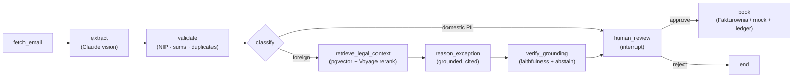

# Legal-Grounded RAG — Plan 03: Evals + Deploy + Docs Implementation Plan

> **For agentic workers:** REQUIRED SUB-SKILL: Use superpowers:subagent-driven-development (recommended) or superpowers:executing-plans to implement this plan task-by-task. Steps use checkbox (`- [ ]`) syntax for tracking.

**Goal:** Turn the corrective-RAG flow into something with **numbers** — a graded eval harness (retrieval recall@k/MRR, faithfulness rate, with/without-RAG treatment accuracy, embedding-model comparison) — add Voyage reranking, wire the real `PgVectorLegalStore` into the deployed app, and surface the work in the README with a committed eval report.

**Architecture:** Pure metric functions (offline-testable) + a golden case dataset + a live-gated harness script that runs the real Voyage/pgvector/Claude path and writes a Markdown report. Reranking is an additive `Reranker` adapter slotted into `PgVectorLegalStore.search` (retrieve top-N by cosine → Voyage rerank → top-k). Deploy injects the real store only when `DATABASE_URL` is set, otherwise falls back to the empty in-memory store (abstention), so local/CI keeps working.

**Tech Stack:** Python 3.12 · `voyageai` (rerank) · `psycopg`/`pgvector` · langchain-anthropic · Fly.io (Postgres) · pytest · ruff. Depends on **Plans 01 + 02**.

---

## Decomposition (Plan 3 of 3)

Derived from [`docs/superpowers/specs/2026-06-27-legal-grounded-rag-design.md`](../specs/2026-06-27-legal-grounded-rag-design.md), milestones 5–6, plus the two additive items deferred from Plan 02 (Voyage reranking; spec §7). **Prerequisite:** Plans 01 + 02 merged. LLM-entailment faithfulness remains an explicit future seam (spec §13) — the deterministic span-containment check from Plan 02 is the shipped faithfulness gate; this plan measures it.

---

## File Structure

**Create:**
- `src/invoicer/rag/eval.py` — pure metrics (`recall_at_k`, `reciprocal_rank`, `mean`, `faithfulness_rate`) + case loader (`load_cases`, `build_invoice_from_case`).
- `src/invoicer/adapters/voyage_reranker.py` — `VoyageReranker` (real, lazy client).
- `data/evals/legal_cases.jsonl` — golden dataset (query fields + expected treatment + expected article refs).
- `scripts/run_evals.py` — live harness: retrieval + faithfulness + ablation; writes the report.
- `docs/evals/legal-rag-report.md` — committed eval report (regenerated by the script).
- Tests: `tests/unit/test_rag_eval.py`, `tests/unit/test_legal_cases_data.py`, `tests/unit/test_voyage_reranker.py`, `tests/unit/test_legal_store_wiring.py`; `tests/live/test_legal_rag_eval_live.py`.

**Modify:**
- `src/invoicer/ports.py` — `Reranker` protocol.
- `src/invoicer/adapters/pgvector_store.py` — optional `reranker` (retrieve top-N → rerank → top-k).
- `src/invoicer/runner.py` — `build_legal_store()` factory.
- `src/invoicer/app.py` — inject `store=build_legal_store()` into `_build_real_graph`; (and `build_demo_graph` in `runner.py`).
- `pyproject.toml` — (no new deps; `voyageai` already added in Plan 01).
- `fly.toml` — `release_command` to ingest the corpus on deploy.
- `README.md` — diagram + RAG section + ports table rows + report link.

---

## Task 1: Retrieval metric functions (`rag/eval.py`)

**Files:**
- Create: `src/invoicer/rag/eval.py`
- Test: `tests/unit/test_rag_eval.py`

- [ ] **Step 1: Write the failing test**

```python
# tests/unit/test_rag_eval.py
from invoicer.rag.eval import mean, recall_at_k, reciprocal_rank


def test_recall_at_k_full_and_partial():
    assert recall_at_k(["a", "b", "c"], {"a", "b"}, k=3) == 1.0
    assert recall_at_k(["a", "x", "y"], {"a", "b"}, k=3) == 0.5
    assert recall_at_k(["x", "y", "a"], {"a"}, k=2) == 0.0  # 'a' poza top-2


def test_recall_at_k_empty_expected_is_one():
    assert recall_at_k(["a"], set(), k=1) == 1.0


def test_reciprocal_rank():
    assert reciprocal_rank(["x", "a", "y"], {"a"}) == 0.5  # 1/2
    assert reciprocal_rank(["a"], {"a"}) == 1.0
    assert reciprocal_rank(["x", "y"], {"a"}) == 0.0


def test_mean():
    assert mean([1.0, 0.0, 0.5]) == 0.5
    assert mean([]) == 0.0
```

- [ ] **Step 2: Run test to verify it fails**

Run: `cd /Users/mski/Developer/Invoicer && uv run pytest tests/unit/test_rag_eval.py -v`
Expected: FAIL — `ModuleNotFoundError: invoicer.rag.eval`.

- [ ] **Step 3: Write minimal implementation**

```python
# src/invoicer/rag/eval.py
from __future__ import annotations


def recall_at_k(retrieved_refs: list[str], expected_refs: set[str], k: int) -> float:
    """Ulamek oczekiwanych article_ref obecnych w top-k zwroconych. Pusty expected -> 1.0."""
    if not expected_refs:
        return 1.0
    top = set(retrieved_refs[:k])
    return len(top & expected_refs) / len(expected_refs)


def reciprocal_rank(retrieved_refs: list[str], expected_refs: set[str]) -> float:
    """1/pozycja pierwszego trafionego oczekiwanego ref (1-indexed); 0.0 gdy brak."""
    for position, ref in enumerate(retrieved_refs, start=1):
        if ref in expected_refs:
            return 1.0 / position
    return 0.0


def mean(values: list[float]) -> float:
    return sum(values) / len(values) if values else 0.0
```

- [ ] **Step 4: Run test to verify it passes**

Run: `cd /Users/mski/Developer/Invoicer && uv run pytest tests/unit/test_rag_eval.py -v`
Expected: PASS (4 passed).

- [ ] **Step 5: Commit**

```bash
cd /Users/mski/Developer/Invoicer
git add src/invoicer/rag/eval.py tests/unit/test_rag_eval.py
git commit -m "feat(evals): retrieval metrics (recall@k, MRR)"
```

---

## Task 2: Golden case dataset + loader

**Files:**
- Create: `data/evals/legal_cases.jsonl`
- Modify: `src/invoicer/rag/eval.py`
- Test: `tests/unit/test_legal_cases_data.py`

- [ ] **Step 1: Write the failing test**

```python
# tests/unit/test_legal_cases_data.py
from pathlib import Path

from invoicer.models import Invoice, TaxTreatment
from invoicer.rag.eval import build_invoice_from_case, load_cases

_CASES = Path(__file__).resolve().parents[2] / "data" / "evals" / "legal_cases.jsonl"


def test_dataset_loads_and_has_expected_fields():
    cases = load_cases(_CASES)
    assert len(cases) >= 5
    for case in cases:
        assert case["expected_treatment"] in {t.value for t in TaxTreatment}
        assert isinstance(case["expected_article_refs"], list)
        assert case["seller_country"]


def test_build_invoice_from_case_produces_valid_invoice():
    case = load_cases(_CASES)[0]
    inv = build_invoice_from_case(case)
    assert isinstance(inv, Invoice)
    assert inv.seller.country == case["seller_country"]


def test_dataset_covers_key_treatments():
    treatments = {c["expected_treatment"] for c in load_cases(_CASES)}
    # rdzen kontrastu podatkowego musi byc reprezentowany
    assert {"import_uslug", "wnt", "import_towarow"} <= treatments
```

- [ ] **Step 2: Run test to verify it fails**

Run: `cd /Users/mski/Developer/Invoicer && uv run pytest tests/unit/test_legal_cases_data.py -v`
Expected: FAIL — loader missing + dataset file missing.

- [ ] **Step 3: Create the dataset**

`data/evals/legal_cases.jsonl` (one JSON object per line; fill `expected_article_refs` to match the `source_id`/`article_ref` you ingested in Plan 01 Task 7):

```json
{"id": "uk-saas", "seller_country": "GB", "currency": "GBP", "no_vat": true, "line_descriptions": ["Subskrypcja SaaS"], "expected_treatment": "import_uslug", "expected_article_refs": ["art. 28b ust. 1", "art. 17 ust. 1 pkt 4"]}
{"id": "us-consulting", "seller_country": "US", "currency": "USD", "no_vat": true, "line_descriptions": ["Konsulting zdalny"], "expected_treatment": "import_uslug", "expected_article_refs": ["art. 28b ust. 1"]}
{"id": "de-goods", "seller_country": "DE", "currency": "EUR", "no_vat": true, "line_descriptions": ["Dostawa podzespolow elektronicznych"], "expected_treatment": "wnt", "expected_article_refs": ["art. 9 ust. 1"]}
{"id": "cn-hardware", "seller_country": "CN", "currency": "USD", "no_vat": true, "line_descriptions": ["Import sprzetu - partia 100 szt"], "expected_treatment": "import_towarow", "expected_article_refs": ["art. 2 pkt 7"]}
{"id": "fr-services", "seller_country": "FR", "currency": "EUR", "no_vat": true, "line_descriptions": ["Uslugi marketingowe"], "expected_treatment": "import_uslug", "expected_article_refs": ["art. 28b ust. 1"]}
{"id": "ie-cloud", "seller_country": "IE", "currency": "EUR", "no_vat": true, "line_descriptions": ["Hosting w chmurze"], "expected_treatment": "import_uslug", "expected_article_refs": ["art. 28b ust. 1"]}
```

In `src/invoicer/rag/eval.py`, add the loader + invoice builder:

```python
import json
from datetime import date
from decimal import Decimal
from pathlib import Path

from invoicer.models import Invoice, LineItem, Party


def load_cases(path: Path) -> list[dict]:
    """Wczytuje golden dataset (JSONL) z przypadkami ewaluacyjnymi."""
    return [json.loads(line) for line in path.read_text(encoding="utf-8").splitlines() if line.strip()]


def build_invoice_from_case(case: dict) -> Invoice:
    """Buduje minimalna Invoice z przypadku eval (do query/klasyfikacji). Kwoty umowne."""
    net = Decimal("1000.00")
    descriptions = case["line_descriptions"]
    per_line = (net / len(descriptions)).quantize(Decimal("0.01"))
    lines = [
        LineItem(
            description=desc,
            quantity=Decimal("1"),
            unit_net=per_line,
            vat_rate=Decimal("0.00") if case.get("no_vat") else Decimal("0.23"),
            net=per_line,
            vat=Decimal("0.00") if case.get("no_vat") else (per_line * Decimal("0.23")),
            gross=per_line if case.get("no_vat") else (per_line * Decimal("1.23")),
        )
        for desc in descriptions
    ]
    total_net = sum((ln.net for ln in lines), Decimal("0"))
    total_vat = sum((ln.vat for ln in lines), Decimal("0"))
    return Invoice(
        seller=Party(name="Eval Seller", country=case["seller_country"]),
        buyer=Party(name="Eval Buyer", nip="5260001246", country="PL"),
        number=f"EVAL/{case['id']}",
        issue_date=date(2026, 1, 1),
        currency=case["currency"],
        lines=lines,
        total_net=total_net,
        total_vat=total_vat,
        total_gross=total_net + total_vat,
    )
```

- [ ] **Step 4: Run test to verify it passes**

Run: `cd /Users/mski/Developer/Invoicer && uv run pytest tests/unit/test_legal_cases_data.py -v`
Expected: PASS (3 passed).

- [ ] **Step 5: Commit**

```bash
cd /Users/mski/Developer/Invoicer
git add data/evals/legal_cases.jsonl src/invoicer/rag/eval.py tests/unit/test_legal_cases_data.py
git commit -m "feat(evals): golden legal-case dataset + loader/invoice builder"
```

---

## Task 3: Faithfulness rate metric

**Files:**
- Modify: `src/invoicer/rag/eval.py`
- Test: `tests/unit/test_rag_eval.py` (append)

- [ ] **Step 1: Write the failing test**

```python
# tests/unit/test_rag_eval.py  (append)
from invoicer.models import Citation
from invoicer.rag.eval import faithfulness_rate
from invoicer.rag.models import RetrievedChunk

_CHUNK = RetrievedChunk(source_id="s", article_ref="a", title="t", url="u",
                        text="Miejscem swiadczenia uslug jest siedziba uslugobiorcy.")


def test_faithfulness_rate_counts_supported_citations():
    supported = Citation(source_id="s", article_ref="a", quoted_span="Miejscem swiadczenia uslug")
    fabricated = Citation(source_id="s", article_ref="a", quoted_span="zdanie spoza zrodla")
    rate = faithfulness_rate([supported, fabricated], [_CHUNK])
    assert rate == 0.5


def test_faithfulness_rate_no_citations_is_zero():
    assert faithfulness_rate([], [_CHUNK]) == 0.0
```

- [ ] **Step 2: Run test to verify it fails**

Run: `cd /Users/mski/Developer/Invoicer && uv run pytest tests/unit/test_rag_eval.py -k faithfulness -v`
Expected: FAIL — `ImportError: cannot import name 'faithfulness_rate'`.

- [ ] **Step 3: Write minimal implementation**

In `src/invoicer/rag/eval.py`, reuse the node's containment helper to avoid drift:

```python
from invoicer.graph.nodes import _span_supported
from invoicer.models import Citation
from invoicer.rag.models import RetrievedChunk


def faithfulness_rate(citations: list[Citation], context: list[RetrievedChunk]) -> float:
    """Ulamek cytatow, ktorych quoted_span jest faktycznie zawarty w cytowanym zrodle."""
    if not citations:
        return 0.0
    by_ref = {(c.source_id, c.article_ref): c.text for c in context}
    supported = sum(
        1
        for cit in citations
        if _span_supported(cit.quoted_span, by_ref.get((cit.source_id, cit.article_ref), ""))
    )
    return supported / len(citations)
```

- [ ] **Step 4: Run test to verify it passes**

Run: `cd /Users/mski/Developer/Invoicer && uv run pytest tests/unit/test_rag_eval.py -v`
Expected: PASS.

- [ ] **Step 5: Commit**

```bash
cd /Users/mski/Developer/Invoicer
git add src/invoicer/rag/eval.py tests/unit/test_rag_eval.py
git commit -m "feat(evals): faithfulness_rate (citation-supported fraction)"
```

---

## Task 4: Voyage reranking in `PgVectorLegalStore`

**Files:**
- Modify: `src/invoicer/ports.py`, `src/invoicer/adapters/pgvector_store.py`
- Create: `src/invoicer/adapters/voyage_reranker.py`
- Test: `tests/unit/test_voyage_reranker.py`

- [ ] **Step 1: Write the failing test**

```python
# tests/unit/test_voyage_reranker.py
from invoicer.adapters.voyage_reranker import VoyageReranker
from invoicer.ports import Reranker


class _Result:
    def __init__(self, index, relevance_score):
        self.index = index
        self.relevance_score = relevance_score


class _Reranked:
    def __init__(self, results):
        self.results = results


class _FakeVoyage:
    def __init__(self):
        self.calls = []

    def rerank(self, query, documents, model, top_k):
        self.calls.append((query, tuple(documents), model, top_k))
        # odwraca kolejnosc: ostatni dokument najtrafniejszy
        ranked = list(range(len(documents)))[::-1][:top_k]
        return _Reranked([_Result(i, 1.0 - n * 0.1) for n, i in enumerate(ranked)])


def test_satisfies_reranker_protocol():
    assert isinstance(VoyageReranker(client=_FakeVoyage()), Reranker)


def test_rerank_returns_indices_and_scores_in_order():
    fake = _FakeVoyage()
    out = VoyageReranker(client=fake, model="rerank-2.5").rerank("q", ["d0", "d1", "d2"], top_k=2)
    assert [idx for idx, _ in out] == [2, 1]  # odwrocona kolejnosc, top-2
    assert out[0][1] == 1.0
    assert fake.calls[0][2] == "rerank-2.5"
```

- [ ] **Step 2: Run test to verify it fails**

Run: `cd /Users/mski/Developer/Invoicer && uv run pytest tests/unit/test_voyage_reranker.py -v`
Expected: FAIL — module + `Reranker` port missing.

- [ ] **Step 3: Write minimal implementation**

Add the `Reranker` protocol to `src/invoicer/ports.py`:

```python
@runtime_checkable
class Reranker(Protocol):
    """Przeszereguj dokumenty wzgledem zapytania. Zwraca (indeks_oryginalny, score) malejaco."""

    def rerank(self, query: str, documents: list[str], top_k: int) -> list[tuple[int, float]]: ...
```

```python
# src/invoicer/adapters/voyage_reranker.py
from __future__ import annotations

from typing import Any

_DEFAULT_MODEL = "rerank-2.5"


class VoyageReranker:
    """Reranker Voyage (rerank-2.5). Klient leniwy (CI: fake)."""

    def __init__(self, *, model: str = _DEFAULT_MODEL, client: Any = None) -> None:
        self._model = model
        self._client = client

    def _voyage(self) -> Any:
        if self._client is None:
            import voyageai

            self._client = voyageai.Client()
        return self._client

    def rerank(self, query: str, documents: list[str], top_k: int) -> list[tuple[int, float]]:
        reranked = self._voyage().rerank(query, documents, model=self._model, top_k=top_k)
        return [(r.index, r.relevance_score) for r in reranked.results]
```

Wire it (optionally) into `PgVectorLegalStore`. In `src/invoicer/adapters/pgvector_store.py`, add a `reranker` param and a top-N fetch + rerank in `search`:

```python
    def __init__(
        self,
        embedder: Embedder,
        *,
        dsn: str | None = None,
        dim: int = 1024,
        conn: Any = None,
        reranker: Any = None,
        fetch_n: int = 20,
    ) -> None:
        self._embedder = embedder
        self._dsn = dsn
        self._dim = dim
        self._conn = conn
        self._reranker = reranker
        self._fetch_n = fetch_n
```

Replace `search`:

```python
    def search(self, query: str, k: int = 5) -> list[RetrievedChunk]:
        q = self._embedder.embed_query(query)
        limit = self._fetch_n if self._reranker else k
        rows = self._connection().execute(
            "SELECT source_id, article_ref, title, url, text, "
            "1 - (embedding <=> %s) AS score "
            "FROM legal_chunks ORDER BY embedding <=> %s LIMIT %s",
            (json.dumps(q), json.dumps(q), limit),
        ).fetchall()
        chunks = [
            RetrievedChunk(
                source_id=r[0], article_ref=r[1], title=r[2], url=r[3], text=r[4], score=r[5]
            )
            for r in rows
        ]
        if not self._reranker or not chunks:
            return chunks[:k]
        order = self._reranker.rerank(query, [c.text for c in chunks], top_k=k)
        return [chunks[idx].model_copy(update={"score": score}) for idx, score in order]
```

- [ ] **Step 4: Run test to verify it passes**

Run: `cd /Users/mski/Developer/Invoicer && uv run pytest tests/unit/test_voyage_reranker.py tests/unit/test_pgvector_store.py -v`
Expected: PASS (reranker unit tests + the existing structural pgvector test).

- [ ] **Step 5: Commit**

```bash
cd /Users/mski/Developer/Invoicer
git add src/invoicer/ports.py src/invoicer/adapters/voyage_reranker.py src/invoicer/adapters/pgvector_store.py tests/unit/test_voyage_reranker.py
git commit -m "feat(rag): VoyageReranker + rerank step in PgVectorLegalStore.search"
```

---

## Task 5: `build_legal_store()` factory + app wiring

**Files:**
- Modify: `src/invoicer/runner.py`, `src/invoicer/app.py`
- Test: `tests/unit/test_legal_store_wiring.py`

- [ ] **Step 1: Write the failing test**

```python
# tests/unit/test_legal_store_wiring.py
from invoicer.adapters.in_memory_legal_store import InMemoryLegalStore
from invoicer.ports import LegalKnowledgeStore
from invoicer.runner import build_legal_store


def test_falls_back_to_in_memory_without_database_url(monkeypatch):
    monkeypatch.delenv("DATABASE_URL", raising=False)
    store = build_legal_store()
    assert isinstance(store, InMemoryLegalStore)
    assert isinstance(store, LegalKnowledgeStore)
    assert store.search("cokolwiek") == []  # pusty store -> abstention w grafie
```

- [ ] **Step 2: Run test to verify it fails**

Run: `cd /Users/mski/Developer/Invoicer && uv run pytest tests/unit/test_legal_store_wiring.py -v`
Expected: FAIL — `ImportError: cannot import name 'build_legal_store'`.

- [ ] **Step 3: Add the factory + wire it**

In `src/invoicer/runner.py`, add:

```python
def build_legal_store():
    """Realny PgVectorLegalStore (Voyage + rerank) gdy DATABASE_URL; inaczej pusty store.

    Pusty InMemoryLegalStore => brak kontekstu => abstention (graf dziala bez bazy/kluczy).
    """
    if os.getenv("DATABASE_URL"):
        from invoicer.adapters.pgvector_store import PgVectorLegalStore
        from invoicer.adapters.voyage_embedder import VoyageEmbedder
        from invoicer.adapters.voyage_reranker import VoyageReranker

        return PgVectorLegalStore(VoyageEmbedder(), reranker=VoyageReranker())
    from invoicer.adapters.fake_embedder import DeterministicEmbedder
    from invoicer.adapters.in_memory_legal_store import InMemoryLegalStore

    return InMemoryLegalStore(DeterministicEmbedder())
```

Wire it into `build_demo_graph` (same file) — add `store=build_legal_store()` to its `build_invoice_graph(...)` call.

In `src/invoicer/app.py`, import and inject it. Add `build_legal_store` to the `from invoicer.runner import ...` line, and pass `store=build_legal_store()` in `_build_real_graph`'s `build_invoice_graph(...)` call:

```python
    return build_invoice_graph(
        extractor=ClaudeVisionExtractor(),
        reasoner=ClaudeExceptionReasoner(),
        ledger=Ledger(settings.data_dir / "ledger.jsonl"),
        sink=sink,
        store=build_legal_store(),
        checkpointer=checkpointer,
    )
```

- [ ] **Step 4: Run test + full suite**

Run:
```bash
cd /Users/mski/Developer/Invoicer
uv run pytest tests/unit/test_legal_store_wiring.py -v
uv run pytest -q
```
Expected: PASS; full suite green.

- [ ] **Step 5: Commit**

```bash
cd /Users/mski/Developer/Invoicer
git add src/invoicer/runner.py src/invoicer/app.py tests/unit/test_legal_store_wiring.py
git commit -m "feat(rag): build_legal_store factory + inject into real/demo graphs"
```

---

## Task 6: Live eval harness + report (`scripts/run_evals.py`)

**Files:**
- Create: `scripts/run_evals.py`, `docs/evals/legal-rag-report.md`
- Test: `tests/live/test_legal_rag_eval_live.py`

- [ ] **Step 1: Write the live-gated test**

```python
# tests/live/test_legal_rag_eval_live.py
import os

import pytest

pytestmark = pytest.mark.skipif(
    not (os.getenv("VOYAGE_API_KEY") and os.getenv("DATABASE_URL")),
    reason="eval RAG wymaga VOYAGE_API_KEY + DATABASE_URL — pominiety",
)


def test_retrieval_recall_meets_bar():
    from scripts.run_evals import evaluate_retrieval

    summary = evaluate_retrieval(k=5)
    # Po zindeksowaniu korpusu realne embeddingi powinny trafiac oczekiwane artykuly.
    assert summary["recall_at_k"] >= 0.7
    assert summary["mrr"] >= 0.5
```

> `scripts` must be importable: run with `PYTHONPATH=.:src`. The harness functions are importable so the live test can assert the numeric bar without re-implementing the loop.

- [ ] **Step 2: Run the live test to confirm it skips**

Run: `cd /Users/mski/Developer/Invoicer && uv run pytest tests/live/test_legal_rag_eval_live.py -v`
Expected: SKIPPED without `VOYAGE_API_KEY`/`DATABASE_URL`.

- [ ] **Step 3: Write the harness**

```python
# scripts/run_evals.py
"""Live eval harness dla legal-grounded RAG. Wymaga VOYAGE_API_KEY + DATABASE_URL.

Uruchom: PYTHONPATH=.:src VOYAGE_API_KEY=... DATABASE_URL=... ANTHROPIC_API_KEY=... \\
    uv run python scripts/run_evals.py
Zaklada zindeksowany korpus (scripts/ingest_legal_corpus.py).
"""

from __future__ import annotations

from pathlib import Path

from invoicer.adapters.pgvector_store import PgVectorLegalStore
from invoicer.adapters.voyage_embedder import VoyageEmbedder
from invoicer.adapters.voyage_reranker import VoyageReranker
from invoicer.rag.eval import (
    build_invoice_from_case,
    load_cases,
    mean,
    recall_at_k,
    reciprocal_rank,
)
from invoicer.rag.query import build_retrieval_query

_CASES = Path(__file__).resolve().parents[1] / "data" / "evals" / "legal_cases.jsonl"
_REPORT = Path(__file__).resolve().parents[1] / "docs" / "evals" / "legal-rag-report.md"


def _store() -> PgVectorLegalStore:
    return PgVectorLegalStore(VoyageEmbedder(), reranker=VoyageReranker())


def evaluate_retrieval(k: int = 5) -> dict:
    store = _store()
    cases = load_cases(_CASES)
    recalls, rrs = [], []
    for case in cases:
        query = build_retrieval_query(build_invoice_from_case(case))
        refs = [c.article_ref for c in store.search(query, k=k)]
        expected = set(case["expected_article_refs"])
        recalls.append(recall_at_k(refs, expected, k=k))
        rrs.append(reciprocal_rank(refs, expected))
    return {"k": k, "n": len(cases), "recall_at_k": mean(recalls), "mrr": mean(rrs)}


def write_report(retrieval: dict) -> None:
    _REPORT.parent.mkdir(parents=True, exist_ok=True)
    _REPORT.write_text(
        "# Legal-Grounded RAG — Eval Report\n\n"
        f"- Cases: **{retrieval['n']}**\n"
        f"- Recall@{retrieval['k']}: **{retrieval['recall_at_k']:.2f}**\n"
        f"- MRR: **{retrieval['mrr']:.2f}**\n\n"
        "_Wygenerowane przez `scripts/run_evals.py` (Voyage + pgvector + Claude)._\n",
        encoding="utf-8",
    )


def main() -> None:
    retrieval = evaluate_retrieval(k=5)
    print(retrieval)
    write_report(retrieval)
    print(f"Raport: {_REPORT}")


if __name__ == "__main__":
    main()
```

Create a placeholder `docs/evals/legal-rag-report.md` so the link in the README resolves before the first live run:

```markdown
# Legal-Grounded RAG — Eval Report

_Uruchom `scripts/run_evals.py` (z VOYAGE_API_KEY + DATABASE_URL + ANTHROPIC_API_KEY), aby wygenerować metryki: Recall@k, MRR, faithfulness, trafność traktowania z/bez RAG._
```

> **Extending the harness (same pattern, additive):** add `evaluate_faithfulness()` (run `ClaudeExceptionReasoner.reason` per case with retrieved context, feed `classification.citations` + context into `faithfulness_rate`), `evaluate_ablation()` (treatment accuracy of the grounded reasoner vs `IdentityReasoner` over the cases), and an embedding-model sweep (`evaluate_retrieval` with `PgVectorLegalStore(VoyageEmbedder(model="voyage-law-2"), ...)` vs `voyage-3-large`). Each appends a section to the report. Keep them in `scripts/run_evals.py`, gated by the same keys.

- [ ] **Step 4: Run the unit + live tests**

Run: `cd /Users/mski/Developer/Invoicer && PYTHONPATH=.:src uv run pytest tests/live/test_legal_rag_eval_live.py -v`
Expected: SKIPPED without keys; with keys + an ingested corpus, PASS (recall@5 ≥ 0.7). Tune `RELEVANCE_THRESHOLD` / `fetch_n` if the bar isn't met.

- [ ] **Step 5: Commit**

```bash
cd /Users/mski/Developer/Invoicer
git add scripts/run_evals.py docs/evals/legal-rag-report.md tests/live/test_legal_rag_eval_live.py
git commit -m "feat(evals): live retrieval eval harness + committed report"
```

---

## Task 7: Deploy — Fly Postgres + corpus ingest on release

**Files:**
- Modify: `fly.toml`, `README.md` (deploy section)

- [ ] **Step 1: Add the release-command ingest to `fly.toml`**

Add a `[deploy]` block so each release (re)ingests the corpus into pgvector (idempotent — Plan 01 Task 6 skips unchanged chunks):

```toml
[deploy]
  release_command = "uv run python scripts/ingest_legal_corpus.py"
```

> Verify the command matches how the app runs in the image (the Dockerfile's module path / `PYTHONPATH`). If the app runs with `PYTHONPATH=src`, use `release_command = "sh -c 'PYTHONPATH=src uv run python scripts/ingest_legal_corpus.py'"`. Confirm by running the ingest locally against a test DB first (Plan 01 Task 9).

- [ ] **Step 2: Document the new secrets in `README.md`**

In the Fly secrets block, add:

```bash
  VOYAGE_API_KEY="..." \
  DATABASE_URL="postgres://..." \
```

And add a one-time provisioning step:

```bash
# Postgres + pgvector for legal-grounding RAG
fly postgres create --name invoicer-db --region ams
fly postgres attach invoicer-db   # sets DATABASE_URL secret
```

- [ ] **Step 3: Verify config parses**

Run: `cd /Users/mski/Developer/Invoicer && fly config validate` (if `flyctl` is installed) or visually confirm the TOML is well-formed.
Expected: config valid (or a clear note that `flyctl` isn't installed locally — the block is standard).

- [ ] **Step 4: Commit**

```bash
cd /Users/mski/Developer/Invoicer
git add fly.toml README.md
git commit -m "feat(deploy): Fly Postgres + corpus ingest on release"
```

---

## Task 8: README — diagram, RAG section, ports table, report link

**Files:**
- Modify: `README.md`

- [ ] **Step 1: Update the Mermaid diagram (foreign branch)**

Replace the diagram's foreign edge so the RAG sub-flow is visible:



- [ ] **Step 2: Add a "Legal-grounded RAG" section**

Add after "Why it's interesting":

```markdown
### Legal-grounded corrective RAG

Foreign-invoice tax reasoning is **grounded in real Polish VAT law**, not the model's memory: the
agent retrieves the relevant provisions (`art. 28b`, `art. 17` reverse charge, WNT, import) from a
**pgvector** store (embeddings + reranking via **Voyage AI**), generates a classification that
**cites its legal basis**, then a **faithfulness check** verifies each citation is actually supported
by the source. When grounding is weak or unsupported, the agent **abstains** — it caps its confidence
and flags the human, never auto-booking. Retrieval quality, faithfulness, and with/without-RAG
treatment accuracy are measured in [`docs/evals/legal-rag-report.md`](docs/evals/legal-rag-report.md).
```

- [ ] **Step 3: Add the new ports to the architecture table**

Add rows under the ports table:

```markdown
| `Embedder` | `DeterministicEmbedder` (CI) | **`VoyageEmbedder`** ✅ (`voyage-3-large`) |
| `LegalKnowledgeStore` | `InMemoryLegalStore` (CI) | **`PgVectorLegalStore`** ✅ (pgvector + Voyage rerank) |
```

- [ ] **Step 4: Verify the README renders and links resolve**

Run: `cd /Users/mski/Developer/Invoicer && ls docs/evals/legal-rag-report.md` (link target exists) and skim the Mermaid block for syntax.
Expected: link target present; diagram parses.

- [ ] **Step 5: Commit**

```bash
cd /Users/mski/Developer/Invoicer
git add README.md
git commit -m "docs: README diagram + legal-grounded RAG section + ports table"
```

---

## Final verification (whole plan)

- [ ] **Run full suite + lint (CI parity)**

Run:
```bash
cd /Users/mski/Developer/Invoicer
uv run pytest -q
uv run ruff check .
uv run ruff format --check .
```
Expected: all unit tests pass; live eval/Voyage/pgvector tests skip without `VOYAGE_API_KEY`/`DATABASE_URL`; ruff clean.

- [ ] **(Optional, with keys) Generate the real report**

Run:
```bash
cd /Users/mski/Developer/Invoicer
PYTHONPATH=src VOYAGE_API_KEY=... DATABASE_URL=... uv run python scripts/ingest_legal_corpus.py
PYTHONPATH=.:src VOYAGE_API_KEY=... DATABASE_URL=... ANTHROPIC_API_KEY=... uv run python scripts/run_evals.py
git add docs/evals/legal-rag-report.md && git commit -m "chore(evals): refresh legal-rag report"
```
Expected: a committed report with real Recall@k / MRR numbers — the interview-ready artifact.

---

## Self-Review (author check against spec)

- **Spec coverage (milestones 5–6 + deferred §7):** retrieval metrics (Task 1 — §8) ✅; golden dataset + loader (Task 2 — §8,§10) ✅; faithfulness metric (Task 3 — §8) ✅; Voyage reranking in search path (Task 4 — §7) ✅; real store wired into deploy with safe fallback (Task 5 — §3,§9) ✅; live harness + report with recall/MRR and extension points for faithfulness/ablation/embedding-sweep (Task 6 — §8) ✅; Fly Postgres + idempotent release ingest (Task 7 — §9) ✅; README diagram/section/ports/report link (Task 8 — §9) ✅. **Explicit future seam:** LLM-entailment faithfulness (§13) — the deterministic span check ships and is measured; entailment is an additive judge to layer later.
- **Placeholder scan:** the harness ships retrieval metrics fully; faithfulness/ablation/embedding-sweep are described as concrete additive functions (same pattern) rather than stubbed — flagged as an extension note, not a code placeholder. Dataset `expected_article_refs` must match the `article_ref` values ingested in Plan 01 Task 7 (called out in Task 2).
- **Type/name consistency:** `recall_at_k`/`reciprocal_rank`/`mean`/`faithfulness_rate`/`load_cases`/`build_invoice_from_case` names match across `rag/eval.py`, tests, and `scripts/run_evals.py`. `faithfulness_rate` reuses `graph.nodes._span_supported` (single source — no drift vs the runtime gate). `build_legal_store()` returns a `LegalKnowledgeStore`; `PgVectorLegalStore(embedder, reranker=...)` signature matches Task 4. `Reranker.rerank(query, documents, top_k) -> list[tuple[int, float]]` consistent between port, `VoyageReranker`, and the `PgVectorLegalStore.search` call site.

---

## Execution Handoff

Plan complete and saved to `docs/superpowers/plans/2026-06-27-legal-grounded-rag-03-evals-deploy.md`. This completes the 3-plan arc (Foundation → Graph/Corrective → Evals/Deploy). Two execution options:

**1. Subagent-Driven (recommended)** — fresh subagent per task, review between tasks.

**2. Inline Execution** — executing-plans, batch execution with checkpoints.

Which approach (and start from Plan 01)?
